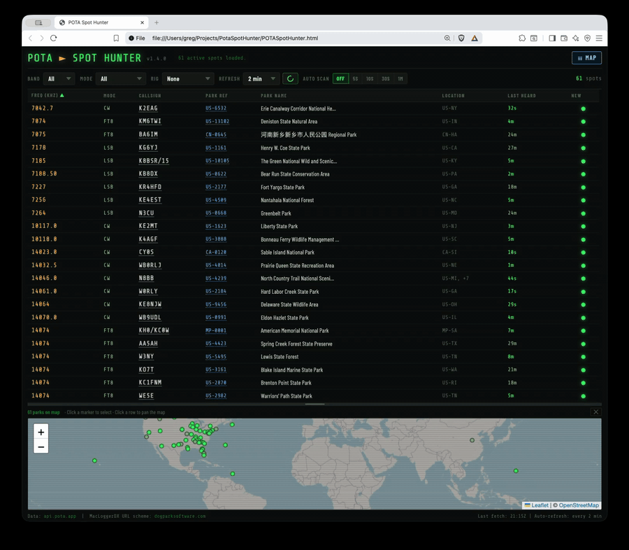
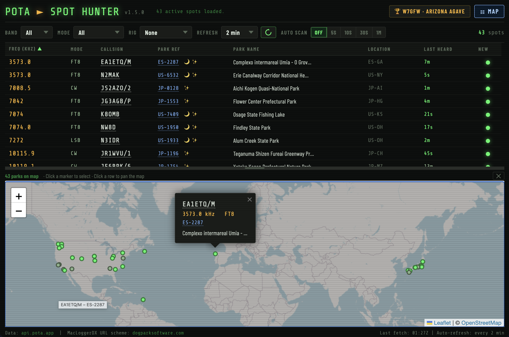
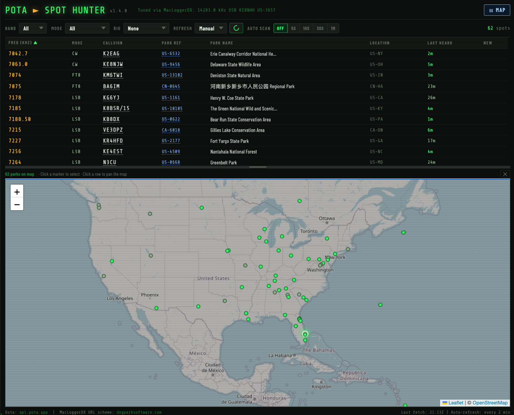

# POTA Spot Hunter

**A live POTA activator spot browser with one-click rig control.**

POTA Spot Hunter fetches active [Parks on the Air](https://parksontheair.com) activator spots from the [POTA API](https://api.pota.app), displays them in a clean filterable table, and lets you tune your radio to any spot with a single click. If you happen to be using MacLoggerDX, then this app will not only tune the radio, but also set the callsign, look up the callsign data, and set the comment field with the POTA reference. You can also use this app with no radio connected at all if you want.

> 🛠 **Status:** Active development. Tested on macOS with MacLoggerDX, flrig, and rigctld (Icom IC-7300).

---

## GIFS/Screenshots

### Demo Gif



### Screenshots





---

## Features

- 📡 **Live spot data** from `api.pota.app` — auto-refreshes at a configurable interval
- 🎛 **Band and mode filtering**
- 🔃 **Flexible sorting** — click any column header to sort by that column; click again to reverse. Sorts by frequency (low to high) by default — ideal for tuning up through the band.
- 🖱 **One-click tuning** — click any row to tune your radio, trigger a callsign lookup, and pre-fill the park reference in your logging software (MacLoggerDX only for now)
- 🔗 **Clickable links** — callsigns and park references link directly to POTA activator and park detail pages
- 🟢 **Age indicators** — spots are colour-coded by how fresh they are
- 🆕 **New spot indicator** — a green dot marks spots that appeared in the most recent refresh and haven't been seen before in this session
- 🔁 **Configurable auto-refresh** — 2, 5, 10, 15, 30, or 60 minutes, or manual only
- 🗺 **Interactive world map** — all active spots plotted on a resizable map; hover a marker to preview, click to tune
- 📻 **Auto Scan** — automatically cycles through the visible spot list, dwelling on each spot for a configurable interval (5s, 10s, 30s, or 1m) and tuning the radio as if you clicked the row. Designed for scanning the bands when propagation is uncertain. Any click or keypress stops the scan; restarting resumes from where you left off.
- 🖥 **Multiple rig control backends:**
  - **MacLoggerDX** — full integration via AppleScript (frequency, mode, callsign lookup, park reference note)
  - **flrig** — frequency and mode via XML-RPC
  - **rigctld (Hamlib)** — frequency and mode via TCP
  - **None** — browse spots without sending any commands

---

## Quick Start

### 1. Download and unzip

Download the latest release ZIP from the [Releases page](https://github.com/gregorywright/PotaSpotHunter/releases/latest) and unzip it. You'll get a few files including:

- `PotaSpotHunter.html` — the web app
- `PotaProxy.py` — the local proxy server

Keep all the files in the same folder.

### 2. Start the proxy

Open a terminal in the unzipped folder and run:

```bash
python3 PotaProxy.py
```

The proxy will automatically open `PotaSpotHunter.html` in your default browser. The **Rig Control** dropdown defaults to **None**, so you can browse live spots right away without any radio attached.

### 3. (Optional) Click-to-tune

If you want to use POTA Spot Hunter to tune your rig, start MacLoggerDX, flrig, or rigctld, then select the appropriate backend from the **Rig Control** dropdown. Click any row or map marker to tune your radio.

---

## How It Works

The app is split into two files that work together:

| File | Purpose |
|---|---|
| `PotaSpotHunter.html` | The web UI — runs in any modern browser |
| `PotaProxy.py` | Local Python proxy — bridges the browser to rig-control software |

The browser cannot talk directly to MacLoggerDX, flrig, or rigctld because of the browser's same-origin security policy. The proxy runs locally on your machine, accepts simple HTTP requests from the web page, and forwards commands to whichever rig-control backend you have configured.

```
Browser (PotaSpotHunter.html)
        │
        │  HTTP  GET /tune/mldx?freq=14074&mode=FT8&callsign=W1AW&note=POTA+US-1234
        ▼
PotaProxy.py  (localhost:8080)
        │
        ├── MacLoggerDX  via osascript / AppleScript
        ├── flrig        via XML-RPC  (port 12345)
        └── rigctld      via TCP      (port 4532)
```

---

## Requirements

| Requirement | Notes |
|---|---|
| Python 3.6+ | Standard on macOS 12+. Install via [Homebrew](https://brew.sh): `brew install python` |
| A modern browser | Safari, Chrome, Firefox, or Edge |
| **One** of the following *(optional — only needed for click-to-tune)*: | |
| [MacLoggerDX](https://dogparksoftware.com/MacLoggerDX.html) | macOS only. |
| [flrig](http://www.w1hkj.com/files/flrig/) | macOS, Linux, Windows. |
| [rigctld](https://hamlib.github.io) (Hamlib) | macOS, Linux, Windows. `brew install hamlib` on macOS. |

No third-party Python packages are required — only the standard library.

---

## Rig Control Setup

### MacLoggerDX

MacLoggerDX must be running on the same Mac as the proxy. No extra configuration is needed — the proxy communicates with MacLoggerDX via AppleScript.

When you click Tune, the proxy will:
1. Set the VFO frequency and mode
2. Trigger a callsign lookup
3. Pre-fill the Note field with the POTA park reference

### flrig

flrig must be running and connected to your radio. Default host/port is `127.0.0.1:12345`. To use a non-default port:

```bash
python3 PotaProxy.py --rig-port 12346
```

### rigctld (Hamlib)

Install Hamlib, then start rigctld with your radio's model number and serial port. Default host/port is `127.0.0.1:4532`.

**Find your radio's model number:**
```bash
rigctld -l | grep -i "your radio name"
```

**Basic start:**
```bash
rigctld -m <model> -r <device> -t 4532
```

**Platform-specific device paths:**

| Platform | Example device path |
|---|---|
| macOS | `/dev/tty.usbserial-XXXX` or `/dev/cu.usbmodem-XXXX` |
| Linux (not tested) | `/dev/ttyUSB0` or `/dev/ttyACM0` |
| Windows (not tested) | `COM3` (check Device Manager) |

> ⚠️ **Icom IC-7300 users (model 3073):** The IC-7300 requires RTS and DTR lines to be held OFF or the radio will reset when rigctld connects. Always start rigctld with the extra flags:
> ```bash
> rigctld -m 3073 -r /dev/tty.usbserial-XXXX -t 4532 \
>   --set-conf=rts_state=OFF --set-conf=dtr_state=OFF
> ```

To use a non-default rigctld port:
```bash
python3 PotaProxy.py --rigctld-port 4533
```

---

## Proxy Command-Line Options

```
usage: PotaProxy.py [-h] [--backend {mldx,flrig,rigctld}]
                     [--port PORT] [--rig-host HOST]
                     [--rig-port PORT] [--rigctld-port PORT]
                     [--no-browser] [--debug]

options:
  --backend    Default rig-control backend (default: mldx)
  --port       Proxy listen port (default: 8080)
  --rig-host   Host for flrig/rigctld (default: 127.0.0.1)
  --rig-port   Port for flrig (default: 12345)
  --rigctld-port  Port for rigctld (default: 4532)
  --no-browser Do not automatically open the browser
  --debug      Enable verbose debug logging
```

**Examples:**

```bash
# Default — MacLoggerDX backend, opens browser automatically
python3 PotaProxy.py

# Use flrig on a non-default port, suppress browser auto-open
python3 PotaProxy.py --backend flrig --rig-port 12346 --no-browser

# Use rigctld on a remote machine on the local network
python3 PotaProxy.py --backend rigctld --rig-host 192.168.1.50
```

---

## Filtering and Sorting

| Control | Options |
|---|---|
| **Band** | All, 160m through 2m |
| **Mode** | All, CW, SSB, FT8, FT4, Other Digital |
| **Auto-refresh** | 2, 5, 10, 15, 30, 60 min, or Manual |
| **Auto Scan** | Off, 5s, 10s, 30s, 1m |

Click any column header to sort by that column; click again to reverse. The default sort is frequency ascending. Filters apply instantly without reloading.

---

## Proxy API Reference

The proxy exposes a simple REST-like API on `http://localhost:8080`. You can call these endpoints directly from a terminal for testing:

```bash
# Get the app version
curl http://localhost:8080/version

# List available backends
curl http://localhost:8080/backends

# Ping a backend (check if rig software is reachable)
curl http://localhost:8080/ping/mldx
curl http://localhost:8080/ping/flrig
curl http://localhost:8080/ping/rigctld

# Tune a radio (freq in kHz)
curl "http://localhost:8080/tune/flrig?freq=14074&mode=FT8"
curl "http://localhost:8080/tune/mldx?freq=14074&mode=FT8&callsign=W1AW&note=POTA+US-1234+Yosemite"
```

All responses are JSON with an `ok` field:
```json
{ "ok": true,  "backend": "flrig", "freq_hz": 14074000, "mode": "FT8" }
{ "ok": false, "error": "Cannot reach flrig — is it running?" }
```

---

## Adding a New Rig Control Backend

The proxy is designed to be extended. To add a new backend (e.g. OmniRig, DX Lab Suite Commander):

1. Create a class that inherits from `RigBackend` in `PotaProxy.py`
2. Implement `tune(freq_hz, mode)` — receives frequency in Hz and a mode string
3. Optionally implement `ping()` for connection health checks
4. Register it in the `_build_backends()` function
5. Add it to the `rig-select` dropdown in `PotaSpotHunter.html`

See the `FlrigBackend` and `RigctldBackend` classes for worked examples.

---

## File Structure

```
PotaSpotHunter/
├── PotaSpotHunter.html   # Web UI — open this in your browser
├── PotaProxy.py         # Local proxy server
├── LICENSE               # MIT License
├── .gitignore
├── CHANGELOG.md          # Version history
├── requirements.txt      # No third-party dependencies (documents intent)
└── README.md
```

---

## Data Sources

| Source | URL |
|---|---|
| POTA spot API | https://api.pota.app/spot/activator |
| POTA activator profile | `https://pota.app/#/profile/<CALLSIGN>` |
| POTA park detail | `https://pota.app/#/park/<REFERENCE>` |
| MacLoggerDX scripting reference | https://dogparksoftware.com/MacLoggerDX%20Help/mldxfc_script.html |
| Hamlib / rigctld reference | https://hamlib.sourceforge.net/html/rigctld.1.html |
| flrig XML-RPC reference | http://www.w1hkj.com/flrig-help/xmlrpc_commands.html |

---

## License

MIT License — see [LICENSE](LICENSE) for full text.

Copyright (c) 2025 Gregory Wright (W7GFW) &lt;greg@gregorywright.org&gt;

---

## 73

See you on the air. I am usually doing CW at parks near Seattle, and the random contest.

*de W7GFW*
